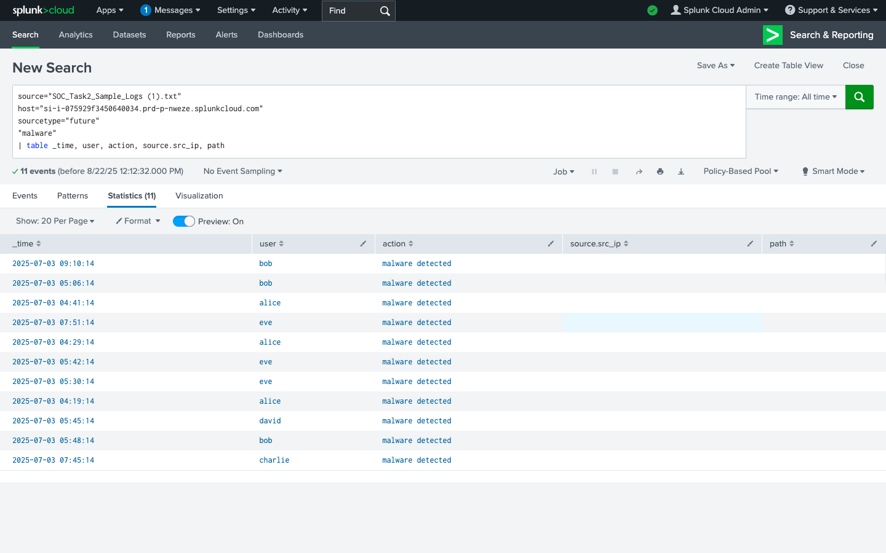
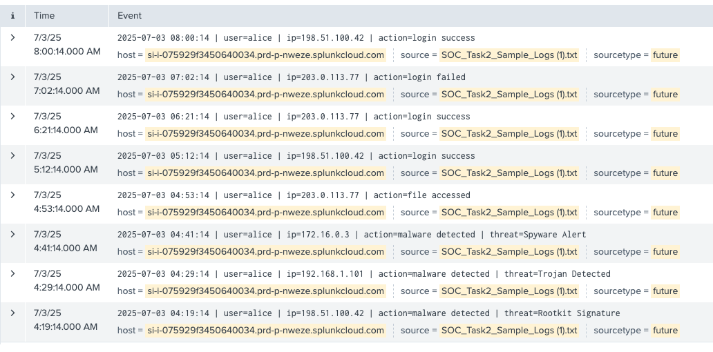
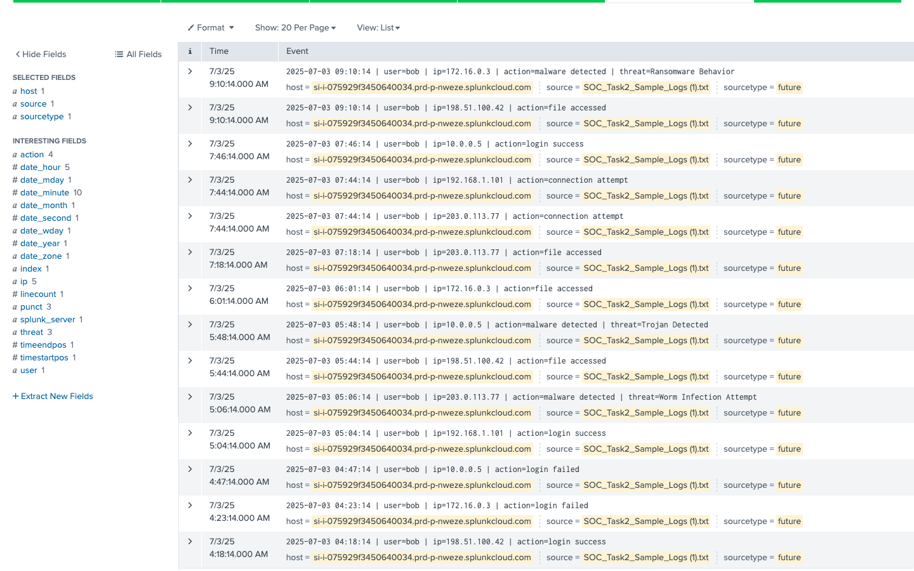
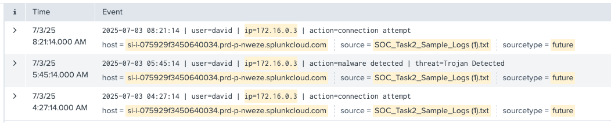
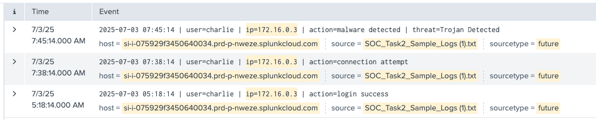

# Incident Response Simulation Report.

**Project:** Simulated system logs with event timestamps and Malware detection alerts.  
**Tools Used:** Splunk  
**Prepared by:** Duncan Maganga  
**Date:** August 22, 2025  
**Task:** 2  

## Executive Summary

This report documents the analysis of simulated system, network, and authentication logs collected from the organization’s SIEM platform. The objective was to detect suspicious activity, classify incidents by severity, and provide guidance on remediation.
During the investigation, five suspicious users were identified, including multiple log-in attempts and several malware signatures. Based on the impact, three incidents were classified as high-priority and two were classified as low-priority.	

## Purpose and Scope

**Purpose:** To simulate real-world incident detection and response using sample SIEM logs  
**Scope:** Analysis covered:  
- System logs with timestamps  
- Network connection logs with source and destination IPs  
- Authentication logs with successful and failed logging attempts  
- Malware detection alerts   

## Tools and Methodology

- **Tools:** Splunk 

## Methodology:
- Correlation and filtering: Applied different SPL queries  
- Classification: Incident ranked as High, Medium, or Low based on the impact.  
- Timeline Construction: Events mapped chronologically to understand the attack flow.  
- Mitigations: Drafted recommended containment and remediation actions.  

## Findings
Five users were flagged with the detection of malware 

## Event id 001 – User id Alice

**Description:** Tried to log in and infect the system with different IP addresses.   
**Severity:**  High  
**Impact:** This created a possible backdoor    
**IP address:** 198.51.100.42  
**Time:** 4:19:14 AM  

## Event id 002 – User id  Bob

**Description:**  Compromised the system with ransomware and started accessing files.   
**Severity:** High  
**Impact:** File Encryption and ransomware   
**IP Address:** 172.16.0.3  
**Time:** 9:10:14 AM

## Event id 003 – User id David

**Description:** Trojan was detected and blocked   
**Severity:** Low  
**Impact:** This did not hit the system.  
**IP Address:** 172.16.0.3  
**Time:** 5:45:14 AM  

## Event id 004 – User id Charlie

**Description:** Trojan was detected and blocked   
**Severity:**  Low  
**Impact:** This created a possible backdoor    
**IP Address:** 172.16.0.3  
**Time:** 7:45:14 AM  

## Event id 005 – User id Eve

**Description:** Multiple login attempts with different IP addresses affected the system with a rootkit.  
**Severity:** High  
**Impact:** Gives attacker escalation privilege, stealth and evasion, credential theft, and backdoor access.  
**IP Address:** 10.0.0.5  
**Time:** 7:51:14 AM  

## Mitigations.
- Enable MFA, strong password rules, account lockout rules, and limit or restrict remote access to trusted networks.
- Block malicious IPs and domains, apply aggressive filtering, and use DNS filtering with threat intelligence feeds.  
- Keep systems patched, update Antivirus and EDR, and also apply least-privileged and application whitelisting  
- Tune SIEM rules and conduct continuous threat hunting   
- Isolate the compromised host immediately and analyze for persistence or lateral movement.  
- Educate staff on phishing, credential security, and reporting suspicious activity  
- Maintaining tested backups and an incident response playbook for rapid recovery.  
